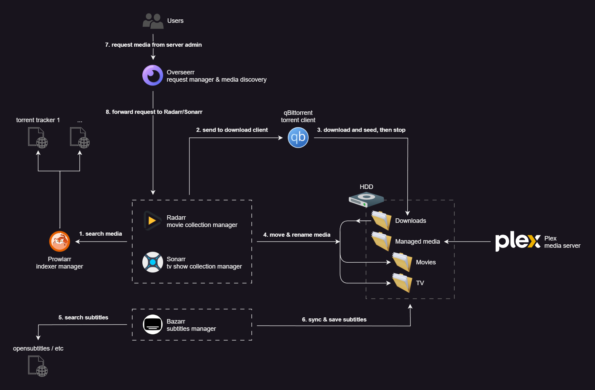

# Plex

# Things to pay attention to

- if your device cannot play the specific video (or subtitle) format, Plex will try to transcode your media to a playable format
- if you need this, you will need more expensive hardware
- if you don't (because you pay attention to what formats you download), you can basically run this on a toaster
- you can force disable transcoding on your Plex server (recommended IMO)

# Managing your media manually is too much work

- download and move your files to your storage

- follow Plex naming conventions / rules
	- for example, this is a well formatted movie name: `{Movie CleanTitle} {(Release Year)} {tmdb-{TmdbId}} {edition-{Edition Tags}} {[Custom Formats]}{[Quality Full]}{[MediaInfo 3D]}{[MediaInfo VideoDynamicRangeType]}{[Mediainfo AudioCodec}{ Mediainfo AudioChannels]}{[Mediainfo VideoCodec]}{-Release Group}`

We don't want to do any of this by hand.

# Enter Radarr, Sonarr

Radarr will manage your movie library for you, while Sonarr will manage your TV shows.

They can:

- automatically search for media in all your configured torrent/usenet trackers
	- can set quality rules (file size, bitrate, resolution)
		- ex.: i want only 1080p
		- ex.: i want anything between 720p and 4k
	- can set priority/weights based on custom rules
		- ex.: add positive weights to Director's cut / Extended edition versions
		- ex.: add negative weights to releases from groups you dislike
		- ex.: add negative weights to certain video encodings
- automatically download media if/when it is available
- automatically import downloaded media, rename it to follow Plex naming rules, throw away unwanted files
- automatically upgrade media to better quality, if it becomes available

# Sidenotes

- never ever use "Library import" to import your files if they were not managed by Radarr/Sonarr before
	- Library import is for managed libraries
	- if you wanna migrate your existing (non-managed) library, add your series/movies as monitored, then go to Wanted -> Missing -> Manual import
- be careful when downloading season packs of TV shows
	- example:
		- you downloaded a season pack, and you let it auto-import
		- unfortunately, the auto-importert got confused because of the file naming, and now recognises the first episode as the second, the second as the third, and so on
		- now you will have to fix this manually, one by one
		- solution: use the manual importer (Wanted -> Missing -> Manual import), and make sure everything is correct
	- another example:
		- you add a series with 12 season to your Sonarr, but you only monitor the first season
		- you download a season pack with all 12 season in it
		- during import, Sonarr will throw away all the unmonitored files/season

# Bazarr

Bazarr will automatically download subtitles for everything you have. (and sync them to your audio if you want)

# Overseerr

Overseerr is the main web interface my users/family interact with to request media.

I can manually or automatically approve their requests, which will be forwarded to Radarr/Sonarr.

# A word on Plex Pass

- 110 CHF one-time purchase (currently)
- hardware transcoding feature
- auto-skip intro/outro feature
- rewind on resume feature
- multiple edition support (regular, Director's Cut, etc)
- HDR tone mapping 

Note: automatically detecting intros and outros requires transcoding. If I import a series with ~12 seasons (for example), Plex server will keep my Raspberry Pi's fans maxed out (and CPU at ~85c) for a few hours while it processes all the files.

# Current hardware

- Raspberry Pi 5 (8 GB) with an attached external (exFAT) HDD
	- was great for proof of concept, still does everything I need
	- absolutely no transcoding though
	- struggles when detecting intros/outros (as mentioned above)
	- zero backups (if the HDD dies, my library is lost)
	- HDD is in exFAT format because I didn't want to deal with file system permissions (plus easy Windows support is nice)
		- exFAT does not support hardlinking (have to copy files, can take a bit of time, not a big deal)

# Where to next?

- upgrading to any barebones mini-PC with an Intel N100
	- should be able to handle any transcoding I need
- add VPN before torrent client (strongly recommended)
- considering making Plex and Overseerr accessible from the public internet
- add a NAS
	- for me, probably a Synology with 4 bays, or maybe I'll take a look at https://unraid.net/
	- technically, if you update the ram in your Synology, you could run this entire stack on your NAS

# How to set this up?

This is gonna be a rough tutorial. Check the links, they will contain all the information you need. Reach out to me if you need further help.

1. Radarr/Sonarr (https://wiki.servarr.com/en/radarr & https://wiki.servarr.com/en/sonarr)
	1. Settings > Media Management
		1. Set the media & folder formats
			1. https://trash-guides.info/Radarr/Radarr-recommended-naming-scheme/
	2. Settings > Custom formats
		1. Add/import your desired custom formats
			1. https://trash-guides.info/Radarr/Radarr-import-custom-formats/
	3. Settings > Quality profiles
		1. Set up your quality profiles and custom format weights
	4. Settings > Download clients
		1. Connect your download client
2. Prowlarr (https://wiki.servarr.com/en/prowlarr)
	1. Indexers
		1. Add your desired indexers
	2. Settings > Apps
		1. Connect your Radarr instance
		2. Connect your Sonarr instance
	3. (optional) Settings > Indexers
		1. Add captcha solver (FlareSolverr - https://trash-guides.info/Prowlarr/prowlarr-setup-flaresolverr/)
3. qBittorrent
	1. After the first run, you will have to get the initial login password from its logs
		1. `docker logs qbittorrent-nox`
		2. make sure your download folder is set according to the volumes attached in your docker compose file
			1. for example, mine is set to `/data/downloads` (NEVER download directly to your managed media library)
4. Overseerr
	1. Settings > Plex
		1. Add your Plex
	2. Set General and User settings according to your needs (auto approve requests if you want)
	3. Users
		1. Create local users for non-admins if you want
	4. Settings > Users > Auto-requets
		1. You can enable auto-requests from your Plex watchlists
5. Bazarr (https://trash-guides.info/Bazarr/)
6. Hardlinks / docker volumes
	1. I guess this is optional, but if you set up your volumes correctly, you can avoid slow/expensive COPY operations when your media is being moved around
		1. https://trash-guides.info/Hardlinks/Hardlinks-and-Instant-Moves/

